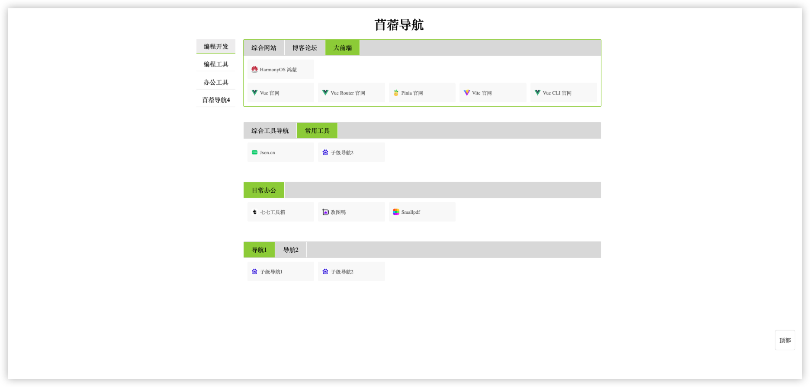

# JJC_Navigation
个人的定制化导航页面

> **苜蓿导航** 是一个可以本地单机导航的仓库，将自己日常繁多的浏览器标签页，通过自己本地管理的方式，更加优美的展示！

> **思路来源：**
> - 最开始的时候是经常使用百度的首页自定义导航，感觉很是方便，而且也经常使用；
> - 直到后来的某一天，添加链接的时候，不是提示链接无效，就是提示超出标签数量，无法继续添加；
> - 再之后则是通过 `Markdown` 的方式搞了个私人导航页面，但是发现页面上并不是很美观，也就一直将就着用了；
> - 直到最近心血来潮就搞了一个打算本地单机的定制化导航页面。

> **使用方式：**
> - 通过 `https://github.com/jijiucheng/JJC_Navigation.git` 或 `git@github.com:jijiucheng/JJC_Navigation.git` 将仓库克隆到本地；并解压到指定的文件目录；
> - 然后将根目录下的 `html` 文件通过浏览器打开，在浏览器的地址栏会获取到 `绝对地址`；
> - 可以将这个地址保存到浏览器的标签栏，亦或者可以给浏览器设置默认打开页面也行，这样的话，以后浏览器每次启动都可以快捷到进入到该导航页面。

> **数据的增删改：**
> - 在 `navigation.js` 文件中的顶部有一个 `list` 的属性，展开后就是当下的所有导航数据；
> - 可以参考当下的数据结构，自定义添加和删除、更改；
> - 其中部分属性说明：
>   - 导航名称在 `navigation.html` 文件中更改； 
>   - `selectSubIndex`：代表默认打开的时候二级导航页面的选中；
>   - 如果想调整整个页面显示的宽度，在 `navigation.css` 中的 `.container` 中调整 `width` 即可；
>   - 如果想调整单行链接个数，在 `navigation.css` 中的 `.link-item` 中调整 `width` 即可；
>   - 如果想添加占位空链接，只需要将对应数据结构中的所有值全部清空，但仍保留空数据结构即可。
